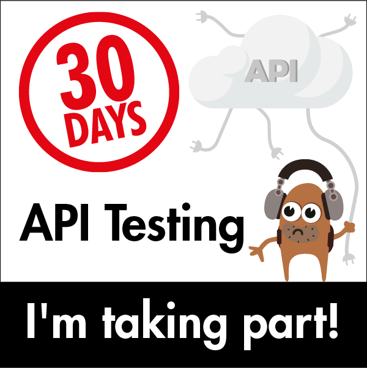
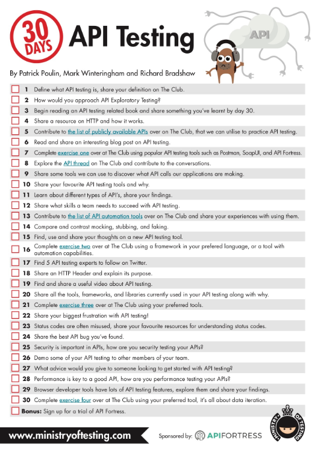

# 30DaysOfApiTesting
For 30 Days Of API Testing challenge

## Day 1
Found a defintion of API testing: “API testing involves testing the application programming interfaces (APIs) directly and as part of integration testing to determine if they meet expectations for functionality, reliability, performance, and security.” 

## Day 2
For API exploratory testing I'd use Postman, the course I started on it seems like a good idea now.

## Day 3
I started reading a book on API testing, by Alan Richardson, the dude behind the Evil Tester podcast, the name ain't "good" but the content is! 😀

## Day 4
I really like the MDN's explanation of HTTP protocol, so here it is: [MDN - An Overview of HTTP](https://developer.mozilla.org/en-US/docs/Web/HTTP/Overview)

## Day 5
Here's a few [publicly available API's](https://rapidapi.com/collection/list-of-free-apis) that can be used for learning purposes.

## Day 6
Today I read an interesting blog post with 10 tips for API testing, [here it is](https://www.katalon.com/resources-center/blog/api-testing-tips/).

